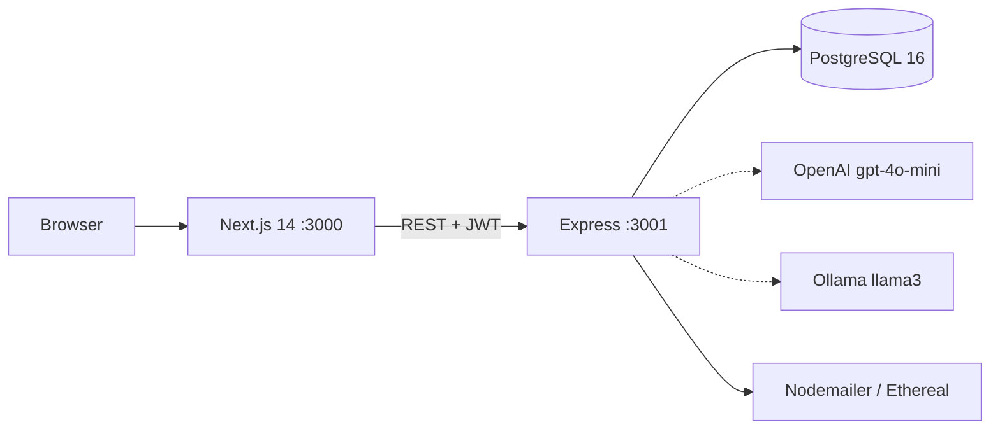

# Sales Intelligence Copilot

CRM comercial fullstack com copiloto de IA: classifica leads por temperatura, move oportunidades num Kanban e gera propostas em PDF. Um único `docker compose up` sobe Next.js 14, Express e PostgreSQL. Projeto de portfólio de [Milton Souza Macedo Junior](https://github.com/miltonjr-dev) (São Paulo) — focado em API REST autenticada, modelagem relacional e integração com OpenAI/Ollama.

[](https://nextjs.org/)
[](https://www.typescriptlang.org/)
[](https://nodejs.org/)
[](https://expressjs.com/)
[](https://www.postgresql.org/)
[](https://www.docker.com/)
[](https://tailwindcss.com/)
[](./LICENSE)

## Funcionalidades

| Módulo | O que faz |
|--------|-----------|
| Termômetro de leads | Classifica **quente / morno / frio** por prioridade e prazo de fechamento |
| Kanban de oportunidades | Arraste o card entre `prospecção → proposta → negociação → fechado` |
| Ficha de clientes | Contato, CNPJ, segmento, site, resumo do atendente e histórico |
| Assistente de IA | Resumo da negociação, próximo passo, urgência e mensagem comercial |
| PDFs | Proposta, resumo de negociação e relatório de pipeline (PDFKit) |
| E-mail | Envio via Ethereal em desenvolvimento (URL de preview) |
| Dashboard | Funil, ticket médio, taxa de conversão e atividade recente |
| CSV | Importação de leads e exportação de leads/oportunidades |
| Auth JWT | Cadastro/login com bcrypt; token de 8 horas |

Não há demo pública no momento. O caminho oficial é rodar localmente com Docker.

## Como rodar

**Pré-requisito:** [Docker](https://docs.docker.com/get-docker/) com Compose v2.

```bash
git clone https://github.com/miltonjr-dev/sales-intelligence-copilot.git
cd sales-intelligence-copilot
cp .env.example .env
docker compose up --build
```

Na primeira subida o Postgres aplica `db/init.sql` (3 clientes, leads e oportunidades de exemplo). Não existe usuário seed — abra o frontend e clique em **Criar Conta**.

| Serviço | URL |
|---------|-----|
| Frontend | http://localhost:3000 |
| Backend | http://localhost:3001 |
| Health check | http://localhost:3001/health |
| PostgreSQL | `localhost:5432` (user/senha padrão: `sic` / `sic123`) |

`JWT_SECRET` no `.env` é obrigatório. `OPENAI_API_KEY` é opcional: sem ela, o restante do CRM funciona; o assistente só responde se houver OpenAI ou Ollama.

Para parar: `docker compose down`. Volumes do banco persistem até `docker compose down -v`.

## Arquitetura



```
Browser ──► frontend (App Router, Tailwind, Axios)
                │
                ▼
           backend (Express)
           ├── /api/auth          JWT + bcrypt
           ├── /api/leads         CRUD + temperatura
           ├── /api/clientes      ficha cadastral
           ├── /api/oportunidades funil / Kanban
           ├── /api/historico     timeline
           ├── /api/metrics       dashboard
           ├── /api/ia            OpenAI ou Ollama
           ├── /api/relatorios    PDFs
           ├── /api/email         Ethereal
           └── /api/csv           import / export
                │
                ▼
           PostgreSQL 16  (schema em db/init.sql)
```

Documentação completa das rotas: **[docs/API.md](docs/API.md)**.

## Stack

| Camada | Tecnologia |
|--------|------------|
| Frontend | Next.js 14 (App Router), TypeScript, Tailwind CSS, Recharts, Axios |
| Backend | Node.js, Express, JWT, bcryptjs, PDFKit, Nodemailer, csv-parse |
| Banco | PostgreSQL 16 |
| Infra | Docker Compose (`frontend` + `backend` + `db`) |

## Estrutura

```
sales-intelligence-copilot/
├── backend/src/           API Express (rotas, JWT, IA, PDFs)
├── frontend/app/          Páginas Next.js (dashboard, leads, kanban, IA)
├── frontend/components/   Sidebar e modais
├── db/init.sql            Schema + seed (clientes/leads/oportunidades)
├── docs/API.md            Contratos HTTP
├── docker-compose.yml
├── .env.example
└── LICENSE
```

## Temperatura dos leads

| Temperatura | Critério (implementado em `GET /api/leads`) |
|-------------|---------------------------------------------|
| Quente | `prioridade >= 8` **ou** fechamento em até 14 dias |
| Morno | `prioridade` entre 5 e 7 |
| Frio | `prioridade < 5` |

## Assistente de IA

O serviço prioriza OpenAI quando `OPENAI_API_KEY` está preenchida; senão tenta Ollama.

```env
# OpenAI
OPENAI_API_KEY=sk-...

# Ollama (no host, visto de dentro do Compose)
OLLAMA_BASE_URL=http://host.docker.internal:11434
OLLAMA_MODEL=llama3
```

```bash
ollama pull llama3
```

## Deploy

Não há URL de produção neste repositório. O código já traz `frontend/vercel.json` e `backend/railway.json` como ponto de partida (Vercel + Railway + Postgres gerenciado). URLs de exemplo comentadas ficam no `.env.example` — não use placeholders como homepage do GitHub.

## Licença

[MIT](./LICENSE) © Milton Souza Macedo Junior.

**Autor:** [miltonjr-dev](https://github.com/miltonjr-dev) · junior fullstack · São Paulo.
